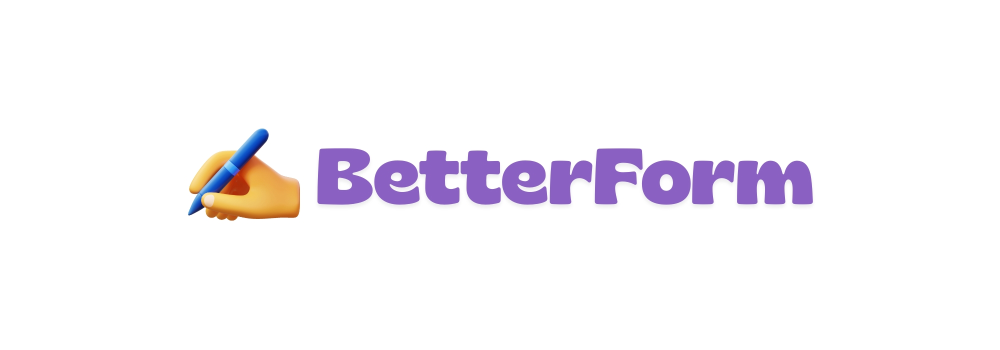

# BetterForm

A beautiful TypeForm alternative. Create engaging forms with a one-question-at-a-time experience.



## Features

- **6 beautiful themes** - Midnight, Ocean, Sunset, Forest, Lavender, Minimal
- **Keyboard navigation** - Navigate with Enter, arrow keys, and scroll wheel
- **Mobile-first forms** - Responsive form-taking experience
- **Secure authentication** - Google OAuth and Magic Link
- **Response dashboard** - View, search, filter, and export to CSV
- **13 question types** - Text, multiple choice, rating, file upload, and more

## Question types

| Type          | Description             |
| ------------- | ----------------------- |
| Short text    | Single line text input  |
| Long text     | Multi-line textarea     |
| Dropdown      | Select one option       |
| Checkboxes    | Select multiple options |
| Email         | Email with validation   |
| Phone         | Phone number input      |
| Number        | Numeric input           |
| Date          | Date picker             |
| Rating        | Star rating (1-5)       |
| Opinion scale | Numeric scale (1-10)    |
| Yes/No        | Binary choice           |
| File upload   | Images and PDFs         |
| Website URL   | URL with validation     |

## Tech stack

- **Framework**: Next.js 16 (App Router)
- **Database**: Supabase (PostgreSQL)
- **Auth**: Supabase Auth (Google OAuth + Magic Link)
- **Styling**: Tailwind CSS + shadcn/ui
- **Animations**: Framer Motion
- **File storage**: Cloudflare R2 (optional)

## Getting started

### Prerequisites

- Node.js 18+
- A Supabase account
- (Optional) Cloudflare account for file uploads

### 1. Clone and install

```bash
git clone https://github.com/vivekrp/betterform.git
cd betterform
npm install
```

### 2. Set up Supabase

1. Create a new project at [supabase.com](https://supabase.com)

2. Run the database schema in SQL Editor:

   - Copy the contents of `supabase/schema.sql`
   - Paste and run in Supabase SQL Editor

3. Configure authentication:

   **Enable Google OAuth:**

   - Go to Authentication, then Providers, then Google
   - Enable and add your Google OAuth credentials
   - Get credentials from [Google Cloud Console](https://console.cloud.google.com)
   - Set redirect URI: `https://YOUR_PROJECT.supabase.co/auth/v1/callback`

   **Configure URLs:**

   - Go to Authentication, then URL Configuration
   - Site URL: `http://localhost:3000`
   - Add redirect URL: `http://localhost:3000/auth/callback`

4. Get your API keys:
   - Go to Settings, then API
   - Copy "Project URL" and "anon public" key

### 3. Configure environment variables

```bash
cp .env.example .env.local
```

Edit `.env.local` with your Supabase credentials:

```env
NEXT_PUBLIC_SUPABASE_URL=https://your-project.supabase.co
NEXT_PUBLIC_SUPABASE_ANON_KEY=your-anon-key
```

### 4. Run the development server

```bash
npm run dev
```

Open [http://localhost:3000](http://localhost:3000) to see your app.

## File uploads (optional)

To enable file uploads, configure Cloudflare R2:

1. Create an R2 bucket in your Cloudflare dashboard
2. Create an API token with R2 read/write permissions
3. Add the credentials to `.env.local`:

```env
R2_ACCOUNT_ID=your-account-id
R2_ACCESS_KEY_ID=your-access-key
R2_SECRET_ACCESS_KEY=your-secret-key
R2_BUCKET_NAME=betterform-uploads
R2_PUBLIC_URL=https://your-bucket.r2.dev
```

## Deployment

### Vercel (recommended)

1. Push your code to GitHub
2. Import the repository in Vercel
3. Add environment variables in Vercel dashboard
4. Deploy

Remember to update your Supabase URL Configuration with your production URL.

## Project structure

```
betterform/
├── app/
│   ├── (auth)/           # Auth pages (login)
│   ├── (dashboard)/      # Protected dashboard pages
│   │   ├── dashboard/    # Forms list
│   │   ├── forms/        # Form builder and responses
│   │   └── settings/     # User settings
│   ├── api/              # API routes
│   ├── auth/             # Auth callback
│   └── f/[slug]/         # Public form pages
├── components/
│   ├── dashboard/        # Dashboard components
│   ├── form-builder/     # Form builder components
│   ├── form-player/      # Form player components
│   ├── responses/        # Response dashboard
│   └── ui/               # shadcn/ui components
├── lib/
│   ├── supabase/         # Supabase clients
│   ├── database.types.ts # TypeScript types
│   ├── questions.ts      # Question type definitions
│   └── themes.ts         # Theme configurations
└── supabase/
    └── schema.sql        # Database schema
```

## License

MIT License - feel free to use this for any project.

## Contributing

Contributions are welcome. Please open an issue or pull request.
